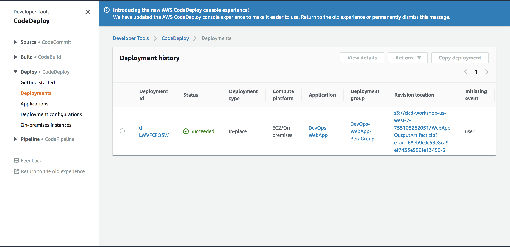

## Lab 2 - 테스트를 위한 자동 배포

### Stage 1: 테스트를 위한 환경 설정

1. 다음 AWS CLI 명령을 사용하여 CloudFormation 스택을 실행하십시오:

```console
user:~/environment/WebAppRepo (master) $ aws cloudformation create-stack --stack-name user@@-DevopsWorkshop-Env \
--template-body https://s3.amazonaws.com/devops-workshop-0526-2051/v1/02-aws-devops-workshop-environment-setup.template \
--capabilities CAPABILITY_IAM
```

**_Note_**
  - 위 스택을 통해 VPC1개, 1개의 서브넷, 라우팅 테이블, 인터넷 게이트웨이, 두개의 EC2 인스턴스가 생성됩니다. EC2 인스턴스는 AWS CodeDeploy agent를 User Data 통해서 설치하게 됩니다.

  - Amazon Linux, RHEL, Ubuntu나 윈도우에서 CodeDeploy 에이전트를 설치하려면 다음 문서를 참조 바랍니다. [Codedeploy 에이전트 설치 참고 문서](http://docs.aws.amazon.com/codedeploy/latest/userguide/codedeploy-agent-operations-install.html) 
 
***

### Stage 2: CodeDeploy Application 및 Deployment Group 생성

1. CodeDeploy 애플리케이션 생성을 위해 아래 명령어를 실행합니다.

```console
user:~/environment/WebAppRepo (master) $ aws deploy create-application --application-name user@@-DevOps-WebApp
```

2. 다음을 실행하여 배포 그룹을 생성하고 지정된 그룹을 지정된 애플리케이션 및 사용자의 AWS 계정과 연결합니다. 서비스 롤은 CloudFormation으로 생성한 **DeployRoleArn 값** 으로 변경합니다.

```console
user:~/environment/WebAppRepo (master) $ echo YOUR-CODEDEPLOY-ROLE-ARN: $(aws cloudformation describe-stacks --stack-name DevopsWorkshop-roles | jq -r '.Stacks[0].Outputs[]|select(.OutputKey=="CodeDeployRoleArn")|.OutputValue')

user:~/environment/WebAppRepo (master) $ aws deploy create-deployment-group --application-name user@@-DevOps-WebApp \
--deployment-config-name CodeDeployDefault.OneAtATime \
--deployment-group-name user@@-DevOps-WebApp-BetaGroup \
--ec2-tag-filters Key=Name,Value=user@@-DevWebApp01,Type=KEY_AND_VALUE \
--service-role-arn <<REPLACE-WITH-YOUR-CODEDEPLOY-ROLE-ARN>>
```

**_Note:_** 태그를 사용하여 인스턴스를 배포 그룹에 연결합니다.

3. 진행 상황을 CodeDeploy 콘솔에서 확인 가능 [CodeDeploy 콘솔 화면](https://console.aws.amazon.com/codedeploy/home).


***

### Stage 3: 배포를 위한 애플리케이션 준비

1. AppSpec 파일이 없으면 AWS CodeDeploy는 애플리케이션 개정판(revision)의 소스 파일을 대상에 매핑하거나 다양한 배포 단계에서 스크립트를 실행할 수 없습니다.

2. Cloud9 에서 아래 내용을 **_user@@-WebAppRepo_** 디렉토리에 **_appspec.yml_** 파일을 생성후 붙여 넣습니다. 

```yml
version: 0.0
os: linux
files:
  - source: /target/javawebdemo.war
    destination: /tmp/codedeploy-deployment-staging-area/
  - source: /scripts/configure_http_port.xsl
    destination: /tmp/codedeploy-deployment-staging-area/
hooks:
  ApplicationStop:
    - location: scripts/stop_application
      timeout: 300
  BeforeInstall:
    - location: scripts/install_dependencies
      timeout: 300
  ApplicationStart:
    - location: scripts/write_codedeploy_config.sh
    - location: scripts/start_application
      timeout: 300
  ValidateService:
    - location: scripts/basic_health_check.sh

```

샘플 파일:


3. 이 스크립트들은 **_appspec.yml_** 파일과 배포 과정에서 함께 실생됩니다.

4. CodeDeploy를 통해 응용 프로그램을 배포 할 예정이므로 CodeDeploy에 필요한 추가 파일을 패키지해야합니다.
 **_buildspec.yml_** 파일을 열어서 아래 artifact 부분에 업데이트 합니다.

```yml
version: 0.1

phases:
  install:
    commands:
      - echo Nothing to do in the install phase...
  pre_build:
    commands:
      - echo Nothing to do in the pre_build phase...
  build:
    commands:
      - echo Build started on `date`
      - mvn install
  post_build:
    commands:
      - echo Build completed on `date`
artifacts:
  files:
    - appspec.yml
    - scripts/**/*
    - target/javawebdemo.war

```

5. buildspec.yml 파일을 수정 후 저장합니다.

6. 리포지토리에 추가하고 업로드 합니다.

```console
user:~/environment/WebAppRepo/ $ git add buildspec.yml
user:~/environment/WebAppRepo/ $ git add appspec.yml
user:~/environment/WebAppRepo/ $ git commit -m "changes to build and app spec"
user:~/environment/WebAppRepo/ $ git push -u origin master

```

***

### Stage 4: 애플리케이션 재배포

1. Run the **_start-build_** command:

```console
user:~/environment/WebAppRepo (master) $ aws codebuild start-build --project-name devops-webapp-project
```

2. Visit the CodeBuild Console to ensure build is successful. Upon successful completion of build, we should see new **_WebAppOutputArtifact.zip_** upload to the configured CodeBuild S3 Bucket.

3. Get the **_eTag_** for the object **WebAppOutputArtifact.zip** uploaded to S3 bucket. You can get etag by visiting S3 console. Or, executing the following command.

```console
user:~/environment/WebAppRepo (master) $ echo YOUR-S3-OUTPUT-BUCKET-NAME: $(aws cloudformation describe-stacks --stack-name DevopsWorkshop-roles | jq -r '.Stacks[0].Outputs[]|select(.OutputKey=="S3BucketName")|.OutputValue')
user:~/environment/WebAppRepo (master) $ aws s3api head-object --bucket <<REPLACE-YOUR-S3-OUTPUT-BUCKET-NAME>> \
--key WebAppOutputArtifact.zip

```

As a sample S3 properties console showing etag below:


4. Run the following to create a deployment. **_Replace_** <<REPLACE-YOUR-S3-OUTPUT-BUCKET-NAME>> with your **_S3 bucket name_** created in Lab 1. Also, update the **_eTag_** based on previous step.

```console
user:~/environment/WebAppRepo (master) $ aws deploy create-deployment --application-name DevOps-WebApp \
--deployment-group-name DevOps-WebApp-BetaGroup \
--description "My very first deployment" \
--s3-location bucket=<<REPLACE-YOUR-S3-OUTPUT-BUCKET-NAME>>,key=WebAppOutputArtifact.zip,bundleType=zip,eTag=<<REPLACE-YOUR-ETAG-VALUE>>
```

5. **Confirm** via IAM Roles, if associated EC2 instance has appropriate permissions to read from bucket specified above. If not, you will get Access Denied at the DownloadBundle step during deployment.

6. **Verify** the deployment status by visiting the **CodeDeploy console**.



7. Check the deploy console for status. if the deployment failed, then look at the error message and correct the deployment issue.

8. if the status of deployment is success, we should be able to view the web application deployed successfully to the EC2 server namely **_DevWebApp01_**

9. Go to the **EC2 Console**, get the **public DNS name** of the server and open the url in a browser. You should see a sample web application.


### Summary

This **concludes Lab 2**. In this lab, we successfully created CodeDeploy application and deployment group. We also modified buildspec.yml to include additional components needed for deployment. We also successfully completed deployment of application to test server.You can now move to the next Lab,

[Lab 3 - Setup CI/CD using AWS CodePipeline](3_Lab3.md)
